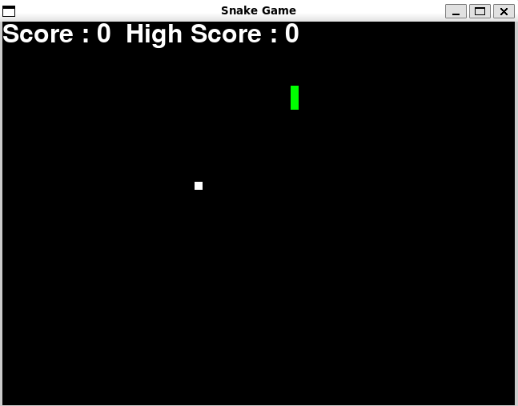
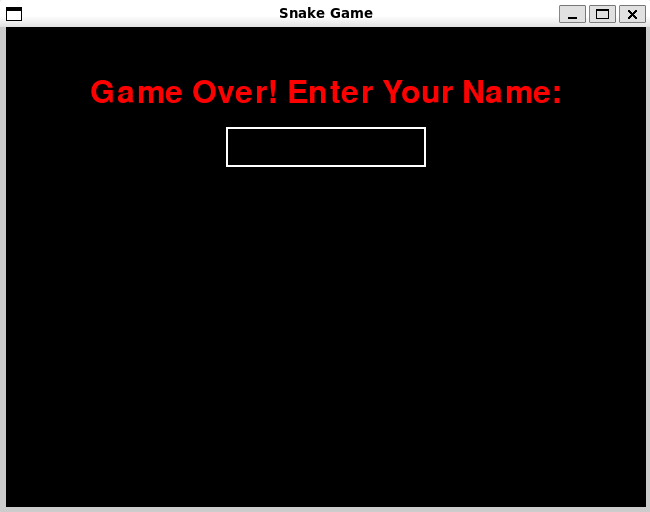

# Snake Game with Pygame and Reinforcement Learning Agent

This project is an enhanced version of the classic Snake Game built using Python and the Pygame library. It features interactive gameplay, high score tracking, and an AI agent that learns to play the game using reinforcement learning.

## Features

- **Classic Snake Gameplay**: Navigate the snake to collect food, growing longer with each piece consumed.

- **Reinforcement Learning Agent**: Watch an AI agent learn to play the game over multiple sessions, improving its performance over time.

- **Agent Modes**: Choose between **Learning Mode**, where the agent learns and updates its strategy, or **Static Mode**, where it plays using its current knowledge.

- **High Score Tracking**: Stores the top 5 scores, including player names or agent identifiers, in a persistent JSON file.

- **On-Screen Name Input**: Players can input their names directly on the game screen after the game ends.

- **Replay or Exit Option**: Players can choose to play again or return to the main menu. The game automatically closes after 10 seconds of inactivity on certain screens.

- **User-Friendly Display**: Shows the current score during gameplay and displays high scores on the game over screen.

## Technology Stack

- **Python 3.10+**

- **Pygame Library**

- **JSON for Data Storage**

- **Pre-Commit Hooks**: Utilizes `Black` and `Prettier` for code formatting.

## How to Start the Game

### Install Dependencies

- **Install Poetry** (if you haven't already):

  ```bash
  curl -sSL https://install.python-poetry.org | python3 -
  ```

- **Install Project Dependencies**:

  ```bash
  poetry install
  ```

### Activate the Virtual Environment

```bash
poetry shell
```

### Run the Game

```bash
python snake_game/snake.py
```

## Usage

### Main Menu

Upon starting the game, you will be presented with options:

1. **Play as User**: Control the snake yourself.
2. **Agent Options**: Manage and observe AI agents.
3. **View High Scores**: See the top 5 high scores.

### Controls

- **For User Gameplay**:

  - Use the **arrow keys** to control the snake's direction.

    

### Agent Options

- **Select an Agent**:

  - Choose from existing agents or create a new one.
  - Agents are saved and can be reused across sessions.

- **Choose Mode**:

  - **Learning Mode (L)**: The agent learns from its gameplay, updating its strategy.
  - **Static Mode (S)**: The agent plays using its existing knowledge without further learning.

- **Agent Gameplay**:

  - Observe the agent as it plays the game autonomously.
  - After each game, view the agent's score and learning progress.
  - Choose to let the agent play again or return to the main menu.

### Game Over

- **For User Gameplay**:

  - Input your name when prompted after losing to record your score.

    

  - View your score ranked on the top 5 list.

- **For Agent Gameplay**:

  - After the agent loses, a summary screen shows:

    - Agent's score.
    - Number of learning cycles this session.
    - Total learning cycles completed by the agent.

  - Decide whether to let the agent play again or return to the main menu.

### Replay or Exit

- **For Users**:

  - Press **Enter** to play again or **ESC** to return to the main menu.
  - The game automatically closes after 10 seconds if no input is detected on the game over screen.

- **For Agents**:

  - Choose whether the agent should play another game or return to the main menu.

## Additional Features

- **High Score Persistence**: Scores are saved across sessions in a JSON file (`high_scores.json`).

- **Agent Learning Persistence**:

  - Agent data and learning progress are saved in the `agents` folder.
  - The Q-table and agent parameters are stored, allowing agents to improve over time.

- **Code Formatting and Quality**:

  - The project uses `pre-commit` hooks with `Black` and `Prettier` for code formatting.
  - JSON files are automatically beautified for readability.

## Development Setup

### Install Pre-Commit Hooks

```bash
pre-commit install
```

### Run Pre-Commit Hooks Manually

```bash
pre-commit run --all-files
```

### Beautify JSON Files

To format all JSON files in the `agents` directory:

```bash
python beautify_json_file.py
```

**`beautify_json_file.py` Script**:

```python
import json
import os

def beautify_json_file(file_path):
    with open(file_path, 'r') as f:
        data = json.load(f)
    with open(file_path, 'w') as f:
        json.dump(data, f, indent=4)

# Directory containing your JSON files
directory = 'agents'

for filename in os.listdir(directory):
    if filename.endswith('.json'):
        file_path = os.path.join(directory, filename)
        beautify_json_file(file_path)
        print(f"Beautified {file_path}")
```

## Contributing

Contributions are welcome! Please ensure code follows the formatting guidelines and that pre-commit hooks pass before submitting a pull request.

## Author
Developed by Pablo Martinez Pancorbo.

## License

[MIT License](LICENSE)

## Acknowledgments

- Developed using the Pygame library.
- Incorporates reinforcement learning concepts for the AI agent.